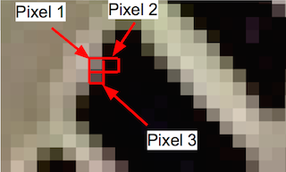

focus-area-detector
===================
The Focus Area Detector is a cloud-based program capable of distinguishing the difference between a sharp line and a blurred line, and can highlight in-focus areas of the input images.  
<br />  
###About the Project
The program is implemented using Hadoop MapReduce framework, it can be configured and deployed to a computer cluster or the cloud. The main task of this program involves calculating the difference of the RGB value between any two consecutive pixels, it is CPU intensive, but the computation can be broken into multiple small tasks and can be processed more efficiently using distributed system.

If an object is *[well-focused](img/thumbnails/detector-1-thumbnail.png)* in the picture, the details on that object should be sharp and clear because the pixel's RGB value in that area changes rapidly. If the object *[out of focus](img/thumbnails/detector-2-thumbnail.png)*, that area seems blurred because the value changes gradually. 

This is the main task: Calculating the difference of the RGB value between (p1, p2), and (p1, p3).
  
  
<br />  
###Getting Started
The Hadoop framework ([download here](http://hadoop.apache.org)) is required to run this program. 
This program is implemented using **`Hadoop 1.1.1`**

In the jar folder, **“ConvertImagesMapReduce-SE6.jar”** and **“ConvertImagesMapReduce-SE7.jar”** are the MapReduce Focus-Area-Detector. Both will read all the images in the input folder, create temporary text-based file for mapper, highlight the in-focus area and calculate the final scores. 

The **“ConvertImage-se6.jar”** and **“ConvertImage-se7.jar”** are non-MapReduce Focus-Area-Detector designed for processing large images (larger than 6000x4000, 24 mega pixels), since the text-based file created by the builder will be very HUGE and the MapReduce process can easily consume lots of free memory. (*performance issue*)  
<br />  
####To Run the MapReduce Focus-Area-Detector:
1. Copy the jar file to Hadoop’s directory and create a new folder "test"
2. Go to folder "test" and create another folder call "input" ([See sample](img/test.png))
3. Pleace the input images in "test"
4. Go back to Hadoop root dir and use the following command 
```
bin/hadoop jar ConvertImagesMapReduce-SE#.jar andrewy.ConvertImages test/ test/output
```

<br />  
####To Run the non-MapReduce Focus-Area-Detector:
Just use the following command, output images will be created in a new folder "test/output"
```
java -cp ConvertImage-se#.jar andrewy.ConvertImage [image name]
```  
<br />  
